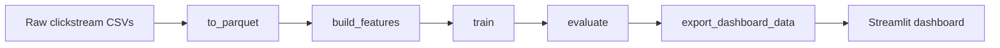

# E-Commerce Clickstream Analytics (PySpark)

[](https://www.python.org/)
[](https://spark.apache.org/)
[](https://cloud.google.com/dataproc)
[](https://streamlit.io/)
[](LICENSE)

Case study docs: [EN](docs/case-study.md) • [FR](docs/case-study.fr.md)  
Quick one‑pager: [EN](docs/one-pager.md) • [FR](docs/one-pager.fr.md)

## Why this exists / What problem it solves

- Local analytics pipelines often drift from cloud outputs, breaking trust in dashboards.
- Config and path changes create “same code, different results” problems.
- Feature leakage inflates metrics and masks real‑world model performance.
- Heavy recomputation makes iteration slow and costly.
- Teams need a repeatable, audit‑friendly run contract across environments.

Reproducible, end-to-end clickstream analytics pipeline built on PySpark. It
ingests raw e-commerce event logs, produces session-level features, trains and
evaluates a baseline conversion model, and exports lightweight aggregates for a
Streamlit dashboard. The project supports local execution and Google Cloud
Dataproc Serverless with a consistent configuration model.

## Highlights

- Spark-based ingestion with schema enforcement and parquet partitioning
- Session-level feature engineering and label creation
- Baseline logistic regression model with leakage-aware feature filtering
- Time-based split when dates are available; random fallback otherwise
- Metrics, figures, and dashboard-ready aggregates in `reports/`
- Local and GCP execution paths wired through the Makefile

## Table of contents

- [Case study (EN)](docs/case-study.md)
- [Case study (FR)](docs/case-study.fr.md)
- [Demo script](docs/demo-script.md)
- [Architecture & data flow](#architecture--data-flow)
- [What to review (for recruiters)](#what-to-review-for-recruiters)
- [Reproducibility contract](#reproducibility-contract)
- [Dataset strategy](#dataset-strategy)
- [Local vs GCP parity](#local-vs-gcp-parity)
- [Limitations & next improvements](#limitations--next-improvements)

## 3-minute Quickstart

```bash
make setup
./scripts/download_data.sh
make rerun_all_force
make dashboard
```

## What to review (for recruiters)

- [`src/clickstream/pipelines/to_parquet.py`](src/clickstream/pipelines/to_parquet.py) — schema enforcement + parquet partitioning
- [`src/clickstream/pipelines/build_features.py`](src/clickstream/pipelines/build_features.py) — sessionization + features + labels
- [`src/clickstream/pipelines/train.py`](src/clickstream/pipelines/train.py) — MLlib pipeline + leakage filtering + splits
- [`src/clickstream/pipelines/export_dashboard_data.py`](src/clickstream/pipelines/export_dashboard_data.py) — dashboard aggregates
- [`config.yaml`](config.yaml) + [`config.gcp.yaml`](config.gcp.yaml) — config‑only portability

## Architecture & data flow

ASCII (quick scan):

```
raw CSVs
  -> to_parquet (clean + partition)
    -> session_features (aggregate + label)
      -> train/test split + model
        -> evaluation metrics + plot
          -> dashboard aggregates (JSON + parquet)
            -> Streamlit app
```

Mermaid (docs/architecture.mmd):



## Pipeline at a glance

```
raw CSVs
  -> to_parquet (clean + partition)
    -> session_features (aggregate + label)
      -> train/test split + model
        -> evaluation metrics + plot
          -> dashboard aggregates (JSON + parquet)
            -> Streamlit app
```

## Architecture

### Components

- Orchestration: `Makefile` targets call pipeline entry points in
  `src/clickstream/pipelines/`.
- Config layer: `config.yaml` (local) and `config.gcp.yaml` (GCP) define paths,
  features, splits, and Spark settings.
- Compute: Spark sessions configured in `src/clickstream/spark.py`.
- Storage: local filesystem or GCS via `src/clickstream/utils/storage.py`.
- Modeling: Spark ML logistic regression (`train.py`) with leakage filtering.
- Reporting: metrics/figures plus dashboard-ready aggregates in `reports/`.
- Visualization: Streamlit app in `dashboard/app.py`.

### System view (local or GCP)

```
          +----------------------+
          |   Makefile / CLI     |
          +----------+-----------+
                     |
                     v
        +--------------------------+
        | Spark pipelines (PySpark)|
        |  - to_parquet            |
        |  - build_features        |
        |  - train / evaluate      |
        |  - export_dashboard_data |
        +------------+-------------+
                     |
                     v
   +-----------------------+   +-------------------+
   | data/processed (GCS)  |   | reports/ (GCS)    |
   | events, features, etc |   | metrics, figures  |
   +-----------+-----------+   +---------+---------+
               |                         |
               v                         v
         +-----------+            +----------------+
         | models/   |            | dashboard/     |
         | logreg/   |            | aggregates     |
         +-----------+            +--------+-------+
                                          |
                                          v
                                   +-------------+
                                   | Streamlit   |
                                   | dashboard   |
                                   +-------------+
```

### Storage mapping (default)

- Local:
  - Raw: `data/raw/`
  - Processed: `data/processed/`
  - Reports: `reports/`
  - Models: `models/`
- GCP (defaults in `config.gcp.yaml`):
  - Raw: `gs://clickstream-bigdata-raw`
  - Processed: `gs://clickstream-bigdata-processed`
  - Reports + Models: `gs://clickstream-bigdata-reports`

## Repository layout

- `config.yaml`: local paths, dataset, features, and Spark settings
- `config.gcp.yaml`: GCS paths and Dataproc settings
- `Makefile`: pipeline orchestration and GCP helpers
- `src/clickstream/`: Spark pipelines, config, and utilities
- `src/01_download_data.py`: Kaggle dataset downloader (optional)
- `dashboard/`: Streamlit app + Dockerfile
- `data/`: raw, interim, processed datasets
- `models/`: saved Spark ML models (default: `models/logreg/`)
- `reports/`: metrics, figures, and dashboard aggregates
- `scripts/`: GCP scripts for Dataproc Serverless
- `notebooks/`: exploratory notebooks (kept lightweight)

## Prerequisites

- Python 3.9+ (tested on 3.9.6)
- Java 8 or 11 for Spark
- `pyspark` (installed via requirements or conda)
- Optional: Google Cloud SDK (`gcloud`, `gsutil`) for GCP runs

## Quickstart (local)

1) Create the environment and install dependencies:

```bash
make setup
```

Or with conda:

```bash
conda env create -f environment.yml
conda activate clickstream
```

2) Validate your environment (Java, Spark, filesystem):

```bash
make env_check
```

3) Prepare raw data (choose one):

- Kaggle or external CSVs: place raw files in `data/raw/` matching
  `dataset.file_pattern` in `config.yaml` (default: `{month}.csv`).
- Kaggle API downloader (optional):

```bash
python src/01_download_data.py \
  --dataset retailrocket/ecommerce-dataset \
  --months 2019-Oct 2019-Nov \
  --outdir data/raw
```

- Synthetic data generator:
  `make download_data` will generate synthetic CSVs when
  `dataset.url_template` is empty. If you use synthetic data, update the
  ingestion schema in `src/clickstream/pipelines/to_parquet.py` or provide raw
  CSVs that match its required columns (see "Data schema" below).

4) Run the pipeline:

```bash
make to_parquet
make build_features
make train
make evaluate
make plots
```

5) Build dashboard aggregates and launch the app:

```bash
make dashboard_data
make dashboard
```

### One-command rerun

```bash
make rerun_all_force
```

### Smoke run (small sample)

```bash
make smoke
```

The smoke target writes to `data/processed_smoke/` and uses
`reports/*_smoke.json` summaries.

## Data schema and expectations

### Ingestion schema (required by `to_parquet`)

The ingestion step expects Kaggle-style clickstream CSVs with these columns:

```
event_time, event_type, product_id, category_id, category_code, brand,
price, user_id, user_session
```

If your raw data uses different field names (for example synthetic data with
`session_id`), update the schema in
`src/clickstream/pipelines/to_parquet.py` or transform your CSVs before running
`make to_parquet`.

### Raw file size check

`make verify_raw` enforces a minimum raw file size (default 100 MB). For smaller
datasets or synthetic data, set `dataset.min_raw_size_mb` in `config.yaml` or run:

```bash
python src/utils/verify_raw.py --config config.yaml --min-size-mb 1
```

## Configuration

Primary controls live in `config.yaml`:

- `paths`: local locations for data, models, and reports
- `dataset`: months, file patterns, synthetic data options
- `features`: numeric features, label column, feature vector column
- `leakage_columns`: denylist for feature leakage protection
- `split`: time-based split configuration
- `training`: logistic regression hyperparameters
- `evaluation`: classification threshold
- `processing`: overwrite and chunking options
- `spark`: Spark app name, master, shuffle partitions, timezone

For GCP runs, update `config.gcp.yaml` to point at your buckets and adjust the
Dataproc settings if needed.

## Outputs and artifacts

After a full local run, you should see:

- `data/processed/events_parquet/`: cleaned, partitioned events
- `data/processed/session_features/`: session-level features + labels
- `data/processed/train/` and `data/processed/test/`
- `models/logreg/`: trained Spark ML model
- `reports/ingestion_summary.json`: ingestion stats and time range
- `reports/features_summary.json`: feature row counts and positive rate
- `reports/metrics.json` and `reports/metrics.csv`: evaluation metrics
- `reports/figures/metrics.png`: metrics visualization
- `reports/dashboard/`: JSON + parquet aggregates for Streamlit

Note: `reports/` and `models/` are committed to provide example outputs; regenerate
from scratch with `make rerun_all_force` (or `make run_all` after data download).

### Visuals (low effort, high impact)

- Metrics plot: `reports/figures/metrics.png`
- Dashboard screenshot: capture after `make dashboard` and place in `docs/screenshots/`

## Dashboard

The Streamlit app reads only precomputed aggregates (fast and laptop-friendly).

Run locally:

```bash
make dashboard
```

Point to a custom location:

```bash
export DASHBOARD_DATA_DIR=reports/dashboard
export REPORTS_ROOT=reports
streamlit run dashboard/app.py
```

The dashboard also supports GCS paths (requires `gcsfs`).

## GCP migration approach

This project is structured to run the same Spark jobs locally or on Dataproc
Serverless. The migration to GCP is accomplished by configuration and packaging
changes rather than code rewrites:

1) **Path externalization**: all data, report, and model paths are defined in
   `config.yaml`. Switching to cloud storage is done by using `config.gcp.yaml`
   with `gs://` paths.
2) **GCS-aware IO**: helpers in `src/clickstream/utils/storage.py` detect GCS
   paths and route reads/writes through Spark's Hadoop filesystem.
3) **Source packaging**: `scripts/gcp_package.sh` zips `src/clickstream` into
   `clickstream_pkg.zip` and uploads it to the reports bucket.
4) **Serverless execution**: `scripts/gcp_submit.sh` submits each pipeline step
   as a Dataproc Serverless batch using the package zip and `config.gcp.yaml`.
5) **Dependencies**: Dataproc installs Python deps listed in
   `requirements.gcp.txt` per batch.
6) **Dashboard on GCS**: the Streamlit app can read `reports/dashboard` from GCS
   by setting `DASHBOARD_DATA_DIR` to a `gs://` path.

If you rename buckets or change regions, update `config.gcp.yaml` and the
bucket values referenced in the scripts under `scripts/`.

## Run on Google Cloud (Dataproc Serverless)

Prerequisites:

- Install and authenticate the Google Cloud SDK (`gcloud auth login`).
- Set project and region (example):

```bash
gcloud config set project clickstream-bigdata
gcloud config set dataproc/region europe-west1
```

Run the pipeline on GCP:

```bash
make gcp_auth_check
make gcp_setup
make gcp_upload_raw
make gcp_package
make gcp_run_all
```

What this does:

- Uploads raw CSVs to GCS
- Packages `src/clickstream` and uploads to the reports bucket
- Runs Spark jobs in Dataproc Serverless using `config.gcp.yaml`
- Installs dependencies from `requirements.gcp.txt` per batch

## Troubleshooting

- Spark hangs on macOS: set `SPARK_LOCAL_IP=127.0.0.1`.
- Java not found: install Java 8 or 11 and ensure `JAVA_HOME` is set.
- Raw data mismatch: confirm columns match the ingestion schema.
- Small datasets failing `verify_raw`: lower `dataset.min_raw_size_mb`.
- Time split not used: ensure `session_date` is present and has multiple dates.

## Manual module execution

If you prefer running modules directly:

```bash
PYTHONPATH=src python -m clickstream.pipelines.to_parquet --config config.yaml
```

The Makefile exports `PYTHONPATH=src` automatically.

## Reproducibility contract

**Deterministic / controlled**
- All paths and processing settings are pinned in `config.yaml` / `config.gcp.yaml`.
- Feature columns and leakage denylist are explicit in config.
- Outputs land in stable artifact locations (`reports/`, `models/`).

**Potentially non‑deterministic**
- Random split when no time column is available.
- Minor Spark execution variance between local and serverless environments.

**Rerun contract**
```bash
make rerun_all_force
```

## Dataset strategy

Why externalize the dataset:
- Keeps the repo light and compliant (no large or private data committed).
- Enables deterministic, public reproduction for reviewers.
- Supports BYO data with config-only changes.

## Local vs GCP parity

The pipeline is portable by configuration:
- `config.yaml` → local paths and Spark settings
- `config.gcp.yaml` → `gs://` paths and Dataproc settings
- No code changes are required to switch environments

## Limitations & next improvements

- Baseline model only (logistic regression).
- No experiment tracking server or model registry.
- Dashboard uses precomputed aggregates (not real‑time).

Next improvements:
- Add MLflow tracking + registry.
- Add CI checks that validate output artifacts.
- Scheduled Dataproc runs + monitoring alerts.

## Dataset

Option A: Public GCS dataset (no login required)

- Bucket: `gs://clickstream-bigdata-raw`
- Objects:
  - `gs://clickstream-bigdata-raw/2019-Oct.csv`
  - `gs://clickstream-bigdata-raw/2019-Nov.csv`
- HTTPS downloads:
  - `https://storage.googleapis.com/clickstream-bigdata-raw/2019-Oct.csv`
  - `https://storage.googleapis.com/clickstream-bigdata-raw/2019-Nov.csv`

Download with the helper script (defaults to the public bucket and downloads into `data/raw`, which is git-ignored):

```bash
./scripts/download_data.sh
```

Download from a different public GCS prefix or bucket:

```bash
GCS_DATASET_URI=gs://your-bucket/your-prefix ./scripts/download_data.sh
```

Option B: Bring your own dataset

1) Place raw CSV files in `data/raw/`.
2) Ensure filenames match `dataset.file_pattern` in `config.yaml` (default: `{month}.csv`).
3) Run the pipeline as usual.

Note for private/custom buckets: authenticate first with `gcloud auth login` (and
`gcloud auth application-default login` if using ADC-based tools).
